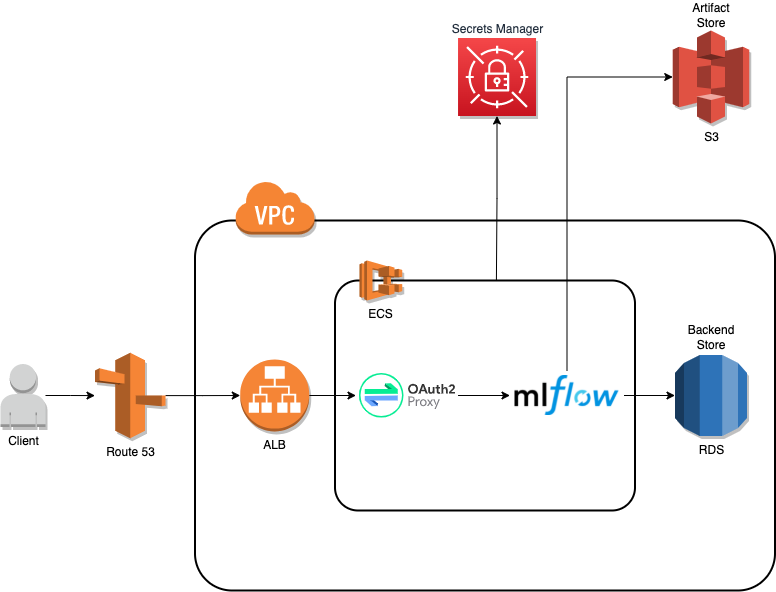

# Deploying secure MLFlow on AWS

One of the many features of an MLOps platform is a capability of tracking and recording experiments which then can be shared and compared. It also involves storing and managing machine learning models and other artefacts.

[MLFlow](https://www.mlflow.org/) is a popular, open source project that tackles the above-mentioned functions. However, the standard MLFlow installation lacks any authorization mechanism. It is often a no-go letting anyone access your MLFlow dashboard. This repository deploys an oauth2-protected MLFlow in your AWS infrastructure.

## Solution overview

You can set up MLFlow in many ways, including a simple localhost installation. But to allow managing experiments and models collaboratively most of the production deployments will most likely end up being a distributed architecture with a remote MLFlow server and remote backend and artefact stores.

The following diagram depicts a high-level architecture of such a distributed approach.



The main MLFlow infrastructure components are:

* MLFlow Tracking Server exposes API for logging parameters, metrics, experiments metadata and UI for visualising the results.
* Amazon Aurora Serverless used as the backend store where MLFlow stores metadata about experiments and runs, i.e., metrics, tags and parameters.
* AWS S3 used as the artefact store where MLFlow stores artefacts, e.g. models, data files.
* [oauth2-proxy](https://oauth2-proxy.github.io/oauth2-proxy/) protects MLFlow endpoints using OAuth2 compatible providers, e.g. Google.

The other AWS components provide runtime/compute environment (Elastic Container Service, ECS), routing (Application Load Balancer, ALB, and Route 53 as a DNS service) and security (Secrets Manager and Virtual Private Cloud, VPC). Please see the [Elasict Container Service](docs/elastic_container_service.md) for details.

## Deployment

A complete Terraform stack is available for an easy and automatic deployment of all the required AWS resources.

### Setting up OAuth 2.0 client

To secure our MLFlow server we need to integrate with an OAuth2 provider. `oauth2-proxy` supports major OAuth2 providers and you can configure whichever you like. (Keep in mind that not all supported providers allow getting an authorization token which is needed for a programmatic access). In this setup Google provider is used. Follow [Setting up OAuth 2.0](https://support.google.com/cloud/answer/6158849?hl=en) instructions to create an OAuth 2.0 client. In the process

* Note the generated `Client Id` and `Client Secret` which we will need later.
* Specify `https://<your_dns_name_here>/oauth2/callback` in the `Authorized redirect URIs` field.

### Prerequisites

You need to have installed the following tools

* AWS CLI
* Terraform CLI (v1.0.0+)

The Terraform stack will create the following resources

* A VPC with the accompanying network setup, e.g. subnets,  where most of the AWS resources run
* An S3 bucket for storing MLFlow artefacts
* Necessary IAM roles and policies for accessing the S3 bucket, secrets in Secrets Manager and running ECS tasks
* An Aurora Serverless database for storing MLFlow metadata
* An ECS cluster with a service running MLFlow tracking server and oauth2-proxy containers
* An Application Load Balancer, ALB, to route traffic to the ECS service and for SSL termination
* An A record in Route 53 to route traffic to ALB

However, prior to running Terraform commands you need to perform a few steps manually.

### Manual Steps

* Create an S3 bucket for storing a Terraform state. This step is not strictly necessary if you choose to keep the state locally

```bash
export TF_STATE_BUCKET=<bucketname>
aws s3 mb s3://$TF_STATE_BUCKET
aws s3api put-bucket-versioning --bucket $TF_STATE_BUCKET --versioning-configuration Status=Enabled
aws s3api put-public-access-block \
    --bucket $TF_STATE_BUCKET \
    --public-access-block-configuration "BlockPublicAcls=true,IgnorePublicAcls=true,BlockPublicPolicy=true,RestrictPublicBuckets=true"
```

Enabling versioning and blocking public access is optional.

* Create a DynamoDB table for state locking. This step is not strictly necessary if you don’t enable state locking and consistency checking

```bash
export TF_STATE_LOCK_TABLE=<tablename>
aws dynamodb create-table \
   --table-name $TF_STATE_LOCK_TABLE \
   --attribute-definitions AttributeName=LockID,AttributeType=S \
   --key-schema AttributeName=LockID,KeyType=HASH \
   --provisioned-throughput ReadCapacityUnits=1,WriteCapacityUnits=1
```

* Create secrets in Secrets Manager. It includes OAuth2 ids, access keys to the S3 bucket and database password

```bash
aws secretsmanager create-secret \
   --name mlflow/store-db-password \
   --description "Password to RDS database for MLFlow" \
   --secret-string "<db_password_here>"
 
aws secretsmanager create-secret \
   --name mlflow/oauth2-client-id \
   --description "OAuth2 client id" \
   --secret-string "<oauth2_client_id_here>"
 
aws secretsmanager create-secret \
   --name mlflow/oauth2-client-secret \
   --description "OAuth2 client secret" \
   --secret-string "<oauth2_client_secret_here>"

aws secretsmanager create-secret \
   --name mlflow/oauth2-cookie-secret \
   --description "OAuth2 cookie secret" \
   --secret-string "<cookie_secret_here>"
```

You can choose any password for the `db_password_here` but make sure that it is strong and secure. Use the `Client ID` and `Client Secret` from the [Setting up Oauth2] section to populate these secrets. The cookie secret can be created using the following python script:
```python
import secrets
random_bytes = secrets.token_bytes(16)
cookie_secret = random_bytes.hex() # results in a secret with a length of 32
```

### Deploy MLFlow
Run the following command to create all the required resources.

```bash
terraform init \
  -backend-config="bucket=$TF_STATE_BUCKET" \
  -backend-config="dynamodb_table=$TF_STATE_LOCK_TABLE" 
export TF_VAR_hosted_zone=<hosted_zone_name>
export TF_VAR_dns_record_name=<mlflow_dns_record_name>
export TF_VAR_domain=<domain>
terraform plan
terraform apply
```

Setting up the AWS infrastructure may take a few minutes. Once it’s completed you can navigate to the MLFlow UI (the URL will be printed in the `mlflow_uri` output variable). Authorise using your Google account.

## Restricting Access to Specific Email Domains

You might be interested in your MLFlow service to be only accessible to users from a specific domain. You can achieve this by replacing the `--email-domain` wildcard `"*"` string with your organization email domain in the relevant [oauth2-proxy](ecs.tf) container.

## Programmatic access

Many MLFlow use cases involve accessing the MLFlow Tracking Server API programmatically, e.g. logging parameters or metrics in your kedro pipelines. In such scenarios you need to pass a Bearer token in the HTTP `Authorization` header. Obtaining such a token varies between providers. For Google, for instance, you could get the token running the following command:

```bash
gcloud auth print-identity-token
```

An authorised curl command listing the experiments would look like this:

```bash
curl -H "Authorization: Bearer $(gcloud auth print-identity-token)" https://<redacted>/api/2.0/mlflow/experiments/list
{
   "experiments": [
       {
           "experiment_id": "0",
           "name": "Default",
           "artifact_location": "s3://<redacted>/0",
           "lifecycle_stage": "active"
       }
   ]
}
```

Passing the authorization token to other tools is SDK-specific. For instance, MLFLow Python SDK supports Bearer authentication via the `MLFLOW_TRACKING_TOKEN` environment variable.
