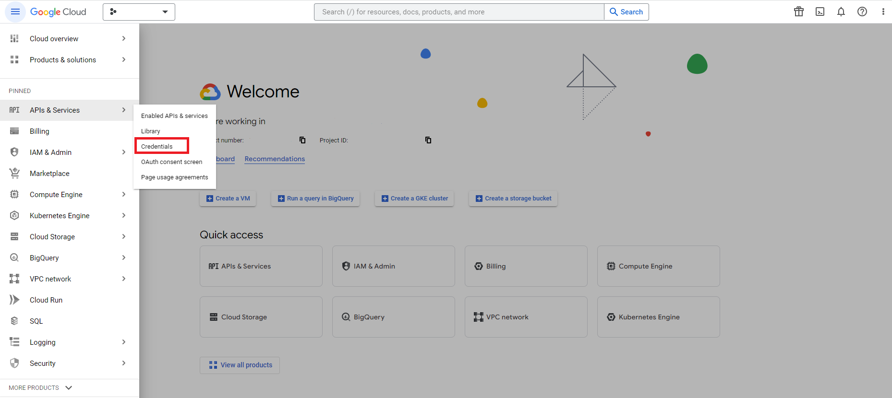
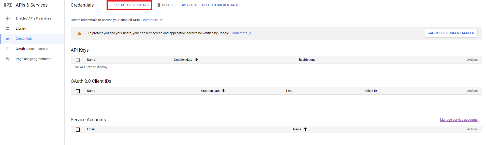
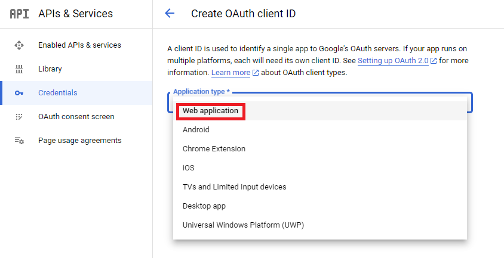
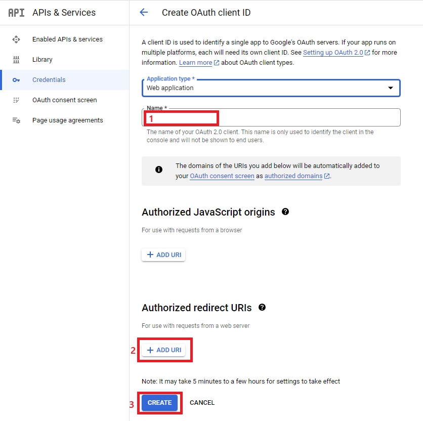
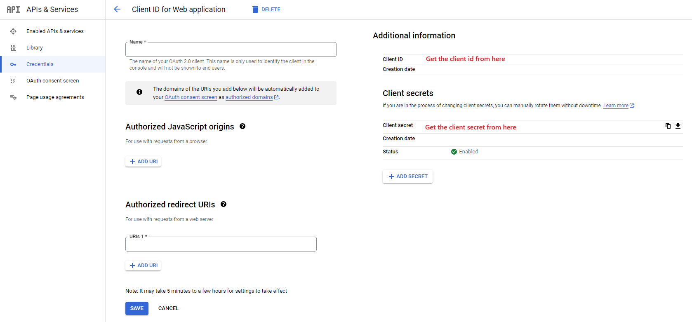

# Step by Step Guide for Oauth2 Setup
The official Google Oauth2 documentation can be found [here](https://support.google.com/cloud/answer/6158849?hl=en). The following are the major steps required to setup Oauth2.

Navigate to the [Google Cloud Console](https://console.cloud.google.com/) and select the project to use for setting up Oauth2. If you do not have a project, you should create one. Then, using the ☰ button, navigate to **API & Services** → **Credentials** as seen in the following Figure:

Click on **Create Credentials** to create a new oauth2 credential:

This will take you to the create credentials page, select **Web Application** as the application type:

Populate the **Name** field. This value is not important and only used in the Google Cloud Console but I recommend uisng a readable name that relates to your project. Populate the **Authorized Redirect URIs** field by clicking the **+ Add URI** button in the console. The value for this URI depends on you [Route 53 setup](route53_setup.md) and is in the form of `https://<your_dns_name_here>/oauth2/callback`.

Once these steps are done you can view your created credetials by clicking on its name. Note the `Client ID` and `Client Secret` which you will need to deploy your stack.

