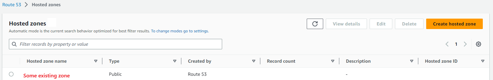

# Step by Step Guide for Route 53 Setup
In this example I am using a pre-existing hosted zone and domain name. If you do not have a domain registered you will need to acquire one from a provider such as [GoDaddy](https://www.godaddy.com). Start by navigating to Route 53 in your AWS console:

I have redacted some information due to privacy. Click on the **Hosted Zones** link highlighted in red. It will display a list of Hosted Zones:

Make note of one of the hosted zones. You will need this later for the `TF_VAR_hosted_zone` environment variable and also to create the **Authorized Redirect URIs** in the Google Cloud Console.

In order to create the redirect uri, you will need to choose a domain. This can be any string but I prefer `mlflow`. If your hosted zone is `foo.com`, the redirect URI will be `https://mlflow.foo.com/oauth2/callback`.

